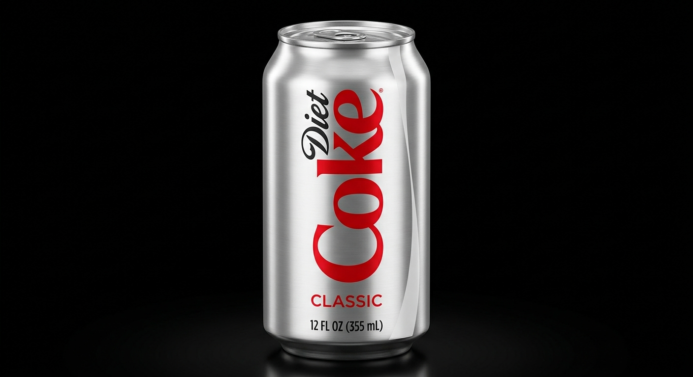
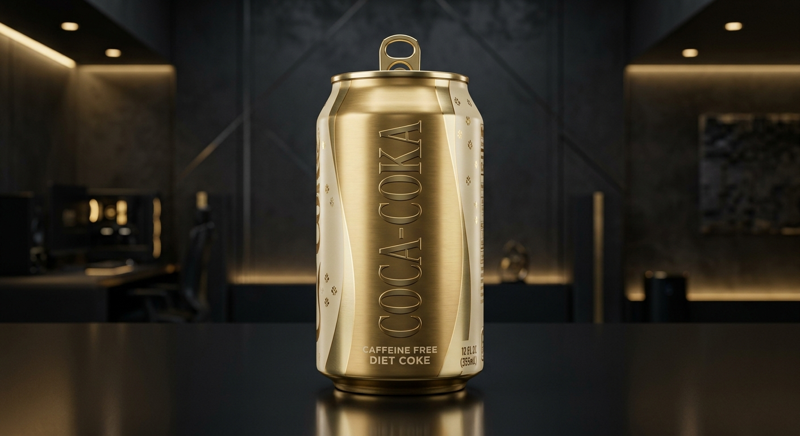
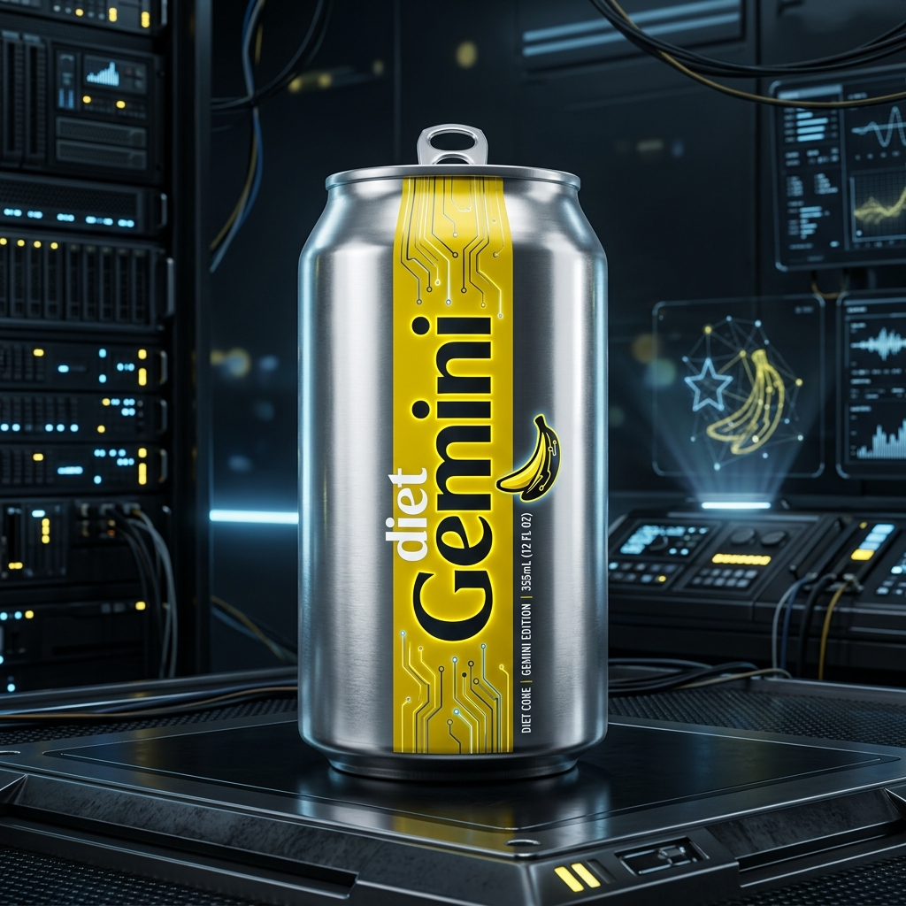
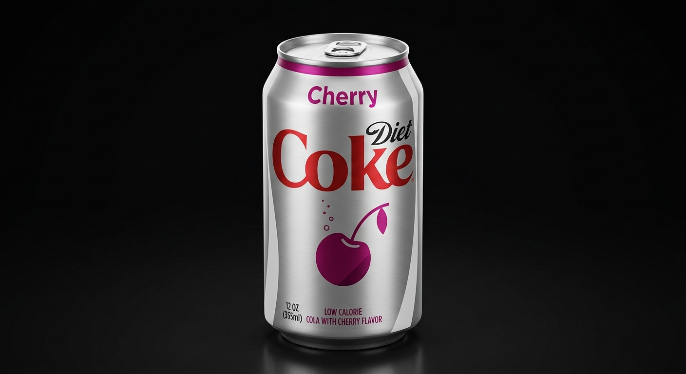
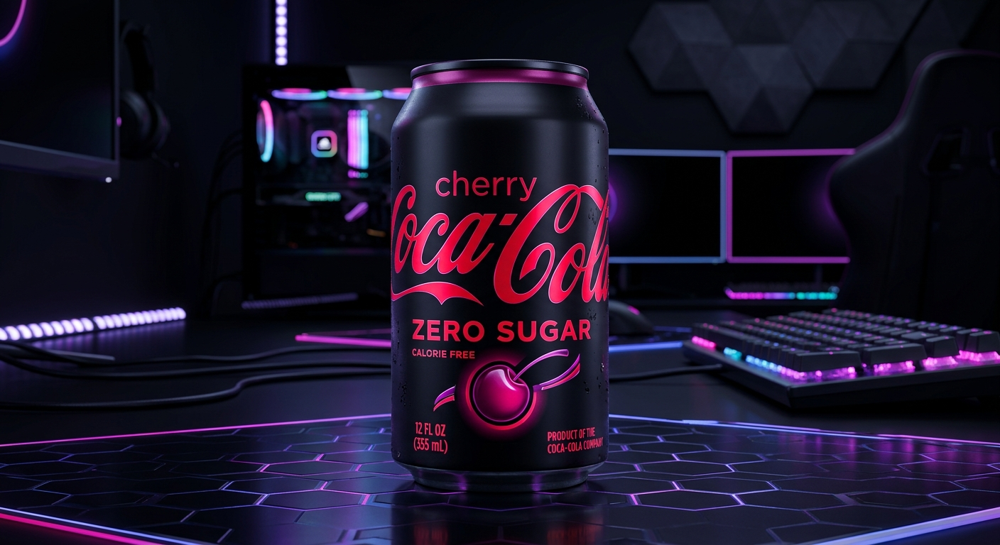

# 🥤 DIET COKE // Stay Extraordinary // Tech Showcase

An interactive, high-fidelity cybernetic telemetry showcase for Diet Coke. Blending industrial tech design, responsive UI layouts, and immersive 3D canvas rendering to visualize the iconic brand.

### 🌐 Live Deployments
*   🚀 **[Vercel Live Site](https://diet-coke-tech-showcase.vercel.app/)**
*   🐙 **[GitHub Pages Mirror](https://naziashakil27.github.io/diet-coke-tech-showcase/)**

---

## 🚀 Key Features

*   **Immersive 3D Can Stage (Three.js):** An interactive 3D metallic cylinder representing the silver canister with real-time mouse-tilt parallax, brushed steel guidelines, and ascending carbonation fizz bubbles.
*   **Quantum Terminal HUD:** Retro telemetry terminal displaying real-time system logs (carbonation levels, temperature indexes, and acoustic pop triggers).
*   **Dynamic Hardware Configurator:** Toggle configurations instantly between the standard Classic Silver can, the Caffeine Free Gold edition, and the limited-run Gemini Nano Banana concept.
*   **The Cherry Dimension:** A dedicated sub-universe section highlighting dark stonefruit variants (Cherry Diet Coke & Cherry Coca-Cola Zero Sugar).
*   **Acoustic Feedback:** Built-in Web Audio API crack-and-fizz pop audio, matching hardware interactions.

---

## 🎨 Flavor Repertoire & Image Gallery

### Standard & Limited Configurations

| Classic Silver Can | Caffeine Free Gold Can | Gemini Nano Banana Can |
| :---: | :---: | :---: |
|  |  |  |
| *Original Code* | *De-Cognitive Accelerant* | *Limited Tech Flavor* |

### Cherry Dimension Variants

| Cherry Diet Coke | Cherry Coca-Cola Zero Sugar |
| :---: | :---: |
|  |  |
| *Luminescent White Armor* | *Stealth Black Armor* |

---

## 🛠️ Technology Stack

*   **Framework:** React 19 + TypeScript
*   **Bundler:** Vite 6 (ESM optimized imports, chunk splitting, hashing assets)
*   **Styling:** Vanilla CSS + Tailwind CSS v4 (Glassmorphism & tech guidelines)
*   **Graphics:** Three.js (WebGL 3D Context)
*   **Sounds:** HTML5 Web Audio API

---

## 💻 Run Locally

### Prerequisites
Make sure you have **Node.js** (v18+) installed.

1.  **Clone & Install Dependencies:**
    ```bash
    git clone https://github.com/naziashakil27/diet-coke-tech-showcase.git
    cd diet-coke-tech-showcase
    npm install
    ```

2.  **Configure Environment:**
    Create a `.env.local` file in the root directory:
    ```env
    GEMINI_API_KEY=your_gemini_api_key_here
    ```

3.  **Run Development Server:**
    ```bash
    npm run dev
    ```
    Open your browser and navigate to `http://localhost:3000/`.

4.  **Production Compilation:**
    To build the fully optimized, production-ready build folder:
    ```bash
    npm run build
    ```
